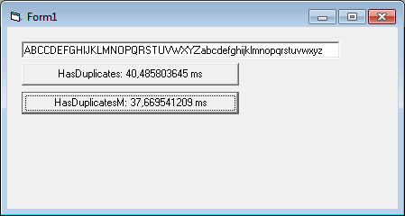



## Duplicate characters

### Description

This is quite a rare need, but here is a very fast solution for finding out whether there is a duplicate of any specific character within a string. Some people use InStr or InStrB as a solution for finding out a character duplicate, but the drawback is that InStr gets slow very fast if the first few characters are not duplicate characters. Also, if there are no duplicates then InStr loops the whole string the amount of length of the string, which can mean hundreds of times at worst case scenarios.

The project provides two functions: HasDuplicates and HasDuplicatesM, the latter is class wrapped. The first one is a straightforward InStrB version. The second uses bitmasking in a Long array as well as safe array tricks to get Integer array access to the characters of the given string. Both functions return a character position of the first duplicate they find, however the results between the functions are always different, because InStrB version returns the first character while the safe array version returns the duplicate. InStrB version can be changed to work the same way.

This code was requested at VBForums, I don't know why, but I made it anyway. The code should have enough comments for people to learn some advanced VB6 memory tricks.

 
### More Info
 

             |
---                |---
**Submitted On**   |2010-05-11 10:30:50
**By**             |[Vesa Piittinen](https://github.com/Planet-Source-Code/PSCIndex/blob/master/ByAuthor/vesa-piittinen.md)
**Level**          |Advanced
**User Rating**    |5.0 (10 globes from 2 users)
**Compatibility**  |VB 6\.0
**Category**       |[String Manipulation](https://github.com/Planet-Source-Code/PSCIndex/blob/master/ByCategory/string-manipulation__1-5.md)
**World**          |[Visual Basic](https://github.com/Planet-Source-Code/PSCIndex/blob/master/ByWorld/visual-basic.md)
**Archive File**   |[Duplicate\_2196871272011\.zip](https://github.com/Planet-Source-Code/vesa-piittinen-duplicate-characters__1-73709/archive/master.zip)

